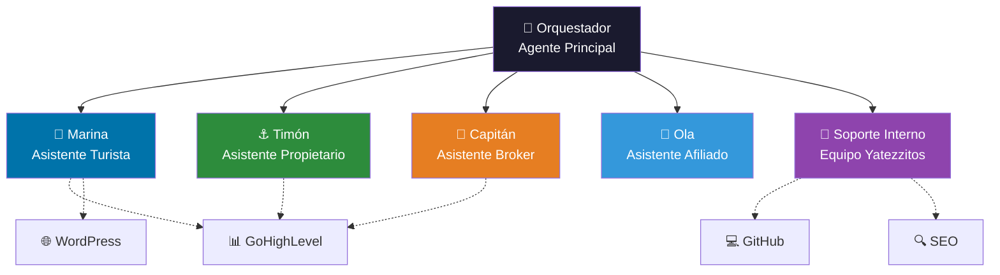

# Yatezzitos IA — Índice de Asistentes

Este directorio contiene las especificaciones de todos los agentes de inteligencia artificial del ecosistema **Yatezzitos Global**.

---

## Arquitectura del sistema de agentes



---

## Catálogo de agentes

| Agente | Nombre | Archivo | Estado | Descripción |
|---|---|---|---|---|
| 🧠 Orquestador | — | [orchestrator.md](orchestrator.md) | ✅ Definido | Agente principal que enruta solicitudes al subagente correcto |
| 🌊 Marina | Turista | [turista.md](turista.md) | ✅ Definido | Atención a turistas: cotización, reserva, dudas, WhatsApp. [Issue #16](https://github.com/YatezzitosMexico/yatezzitos-platform/issues/16) |
| ⚓ Timón | Propietario | [propietario.md](propietario.md) | ✅ Definido | Asistencia a propietarios: onboarding, documentos, disponibilidad. [Issue #17](https://github.com/YatezzitosMexico/yatezzitos-platform/issues/17) |
| 🧭 Capitán | Broker | `broker.md` | 📋 Planificado | Asistencia a brokers y agencias B2B |
| 🌊 Ola | Afiliado | `afiliado.md` | 📋 Planificado | Asistencia a afiliados: links, UTMs, comisiones |
| 🔧 Soporte Interno | Equipo | [soporte-interno.md](soporte-interno.md) | ✅ Definido | IA interna para SEO, copy, marketing, desarrollo. [Issue #18](https://github.com/YatezzitosMexico/yatezzitos-platform/issues/18) |

---

## Cómo funciona el sistema

### 1. El Orquestador recibe toda solicitud
Cualquier interacción llega primero al orquestador, que:
- Identifica el tipo de usuario (turista, propietario, broker, afiliado)
- Delega al subagente correcto
- Vigila guardrails de seguridad y privacidad
- Exige trazabilidad en acciones

### 2. Cada subagente tiene su especialidad
Cada agente tiene conocimiento específico de su área y acceso limitado a las herramientas que necesita.

### 3. Guardrails globales
Todos los agentes comparten estas reglas (ver [AGENTS.md](../../AGENTS.md)):
- ❌ Nunca revelar datos sensibles, credenciales o PII
- ❌ Nunca ejecutar acciones irreversibles sin aprobación humana
- ❌ Nunca inventar datos (precios, disponibilidad, capacidad)
- ✅ Siempre consultar la fuente de verdad correspondiente
- ✅ Siempre escalar a humano cuando no pueda resolver

---

## Prioridad de desarrollo

```
Fase 1 (completada): Orquestador + Reglas globales (AGENTS.md)
Fase 2 (spec listo):  Marina — Asistente Turista (Issue #16) ✅
Fase 3 (spec listo):  Timón — Asistente Propietario (Issue #17) ✅
Fase 4 (spec listo):  Soporte Interno — Equipo (Issue #18) ✅
Fase 5:               Capitán y Ola — Brokers / Afiliados
```

---

## Cómo crear un nuevo asistente

Para agregar un nuevo agente al ecosistema:

1. Crear el archivo de spec en `ai/assistants/[nombre].md`
2. Definir: rol, alcance, guardrails específicos, fuentes de datos, canales, protocolo de escalamiento
3. Registrar el agente en esta tabla (README.md)
4. Crear el issue correspondiente en GitHub
5. Seguir las reglas definidas en `AGENTS.md`

---

## Fuentes de verdad por agente

| Dato | Fuente de verdad | Agentes que lo usan |
|---|---|---|
| Precios y cotizaciones | GoHighLevel / equipo comercial | Marina, Orquestador |
| Disponibilidad | Calendario (futuro) / propietario | Marina, Timón |
| Datos del lead | GoHighLevel | Todos |
| Fichas de yates | WordPress | Marina, Soporte Interno |
| SEO y keywords | WordPress + docs/seo/ | Soporte Interno |
| Pipeline y etapas | GoHighLevel | Marina, Orquestador |
| Documentos de embarcaciones | Propietario / GHL | Timón |

---

*Última actualización: 13 de marzo 2026*
