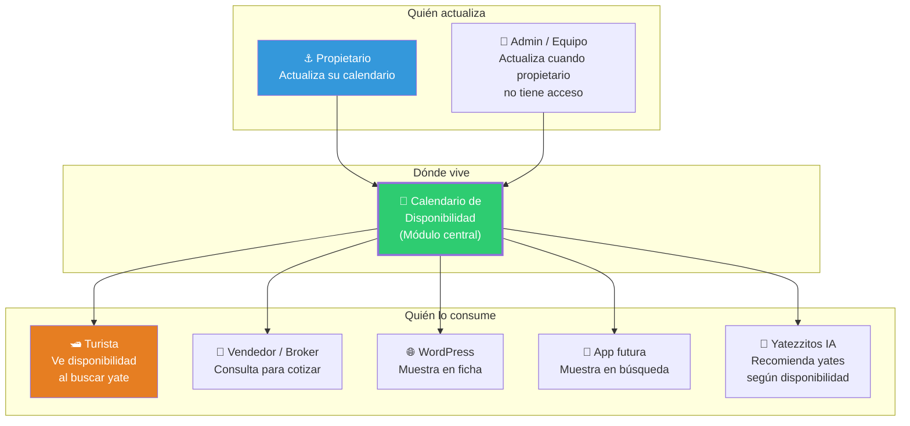
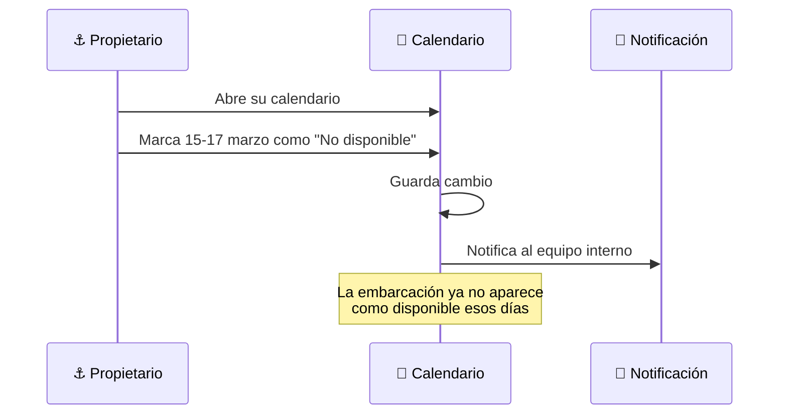
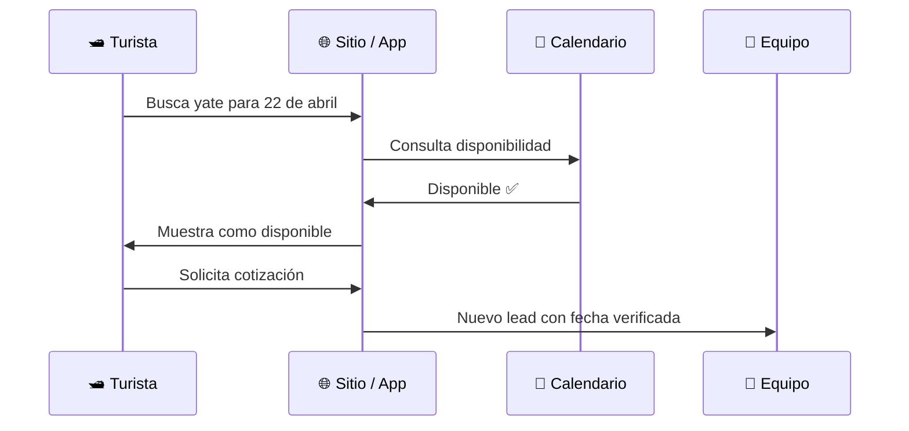
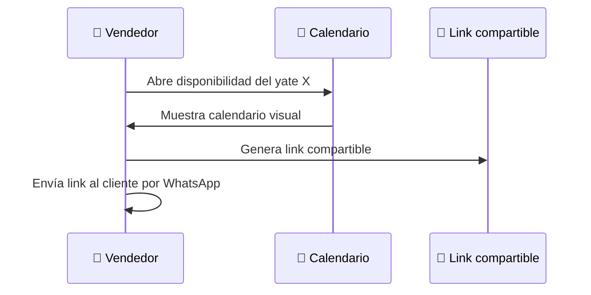
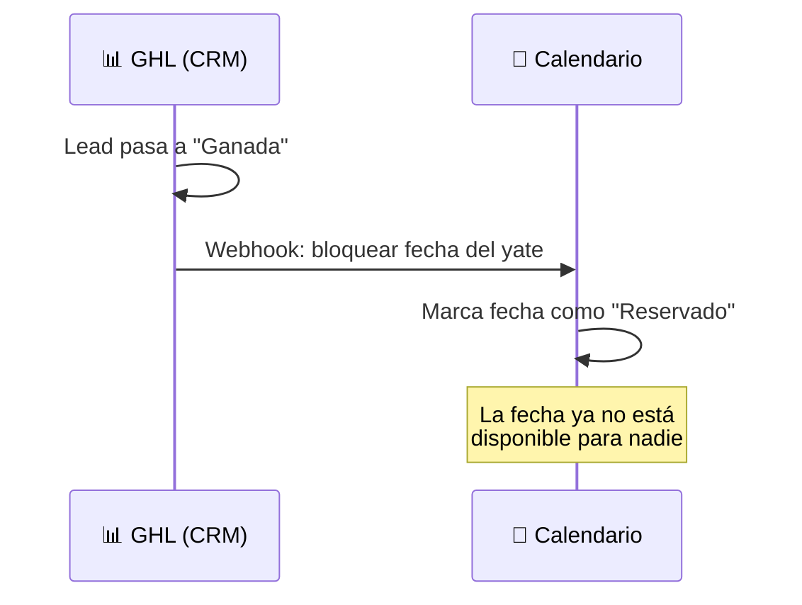
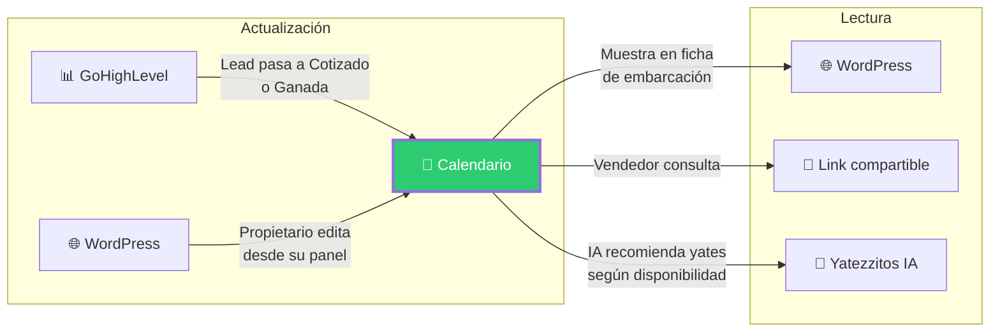

# Calendario de disponibilidad — Diseño funcional

> Documento de diseño · Issue [#9](https://github.com/YatezzitosMexico/yatezzitos-platform/issues/9)

---

## Objetivo

Diseñar la base funcional del módulo de disponibilidad de embarcaciones, el activo tecnológico más crítico para propietarios, vendedores y operación interna.

Este módulo debe responder una pregunta simple pero fundamental:

> **¿Está disponible esta embarcación en esta fecha?**

---

## Por qué es tan importante

| Problema actual | Impacto |
|---|---|
| No existe disponibilidad en tiempo real | Se depende de llamadas/WhatsApp para verificar |
| El equipo pregunta manualmente al propietario | Retrasa la cotización y puede perder el lead |
| No hay visibilidad de ocupación | No se puede planificar oferta ni marketing |
| Vendedores y brokers no ven disponibilidad | Pierden oportunidades de venta |
| No se puede escalar sin este módulo | Cada ciudad nueva multiplica el caos manual |

> **Decisión DEC-027:** El calendario de disponibilidad será uno de los activos tecnológicos más importantes del proyecto.
> **Decisión DEC-028:** La disponibilidad deberá poder compartirse mediante enlace simple.

---

## Diagrama del ecosistema de disponibilidad



---

## Casos de uso principales

### Caso 1 — Propietario actualiza su disponibilidad



### Caso 2 — Turista quiere reservar una fecha



### Caso 3 — Vendedor / broker consulta para cotizar



### Caso 4 — Reserva confirmada bloquea fecha



---

## Estatus posibles de una fecha

| Estatus | Color sugerido | Significado | Quién lo marca |
|---|---|---|---|
| 🟢 **Disponible** | Verde | La embarcación está libre | Por defecto |
| 🟡 **Cotizado** | Amarillo | Hay un lead interesado pero no ha pagado | Automático (GHL → Calendario) |
| 🔴 **Reservado** | Rojo | Fecha apartada con anticipo pagado | Automático (GHL → Calendario) |
| ⚫ **Bloqueado** | Gris oscuro | Propietario bloqueó la fecha (uso personal, mantenimiento) | Propietario / Admin |
| 🟠 **En mantenimiento** | Naranja | Embarcación fuera de servicio temporal | Propietario / Admin |

---

## Datos del evento en el calendario

Cada entrada del calendario debe almacenar:

| Campo | Tipo | Obligatorio | Descripción |
|---|---|---|---|
| `embarcacion_id` | string | ✅ | ID del listing de WordPress (`wp_listing_id`) |
| `fecha_inicio` | date | ✅ | Fecha de inicio del bloqueo/reserva |
| `fecha_fin` | date | ✅ | Fecha de fin del bloqueo/reserva |
| `estatus` | enum | ✅ | disponible / cotizado / reservado / bloqueado / mantenimiento |
| `motivo` | string | Opcional | Razón del bloqueo ("uso personal", "mantenimiento motor") |
| `reserva_id` | string | Solo reservas | ID de la reserva en GHL (`reservacion_id`) |
| `contacto_id` | string | Solo cotizado/reservado | ID del contacto en GHL (`crm_contact_id`) |
| `creado_por` | string | ✅ | Quién creó el evento (propietario / admin / sistema) |
| `fecha_creacion` | datetime | ✅ | Cuándo se creó el registro |
| `ultima_actualizacion` | datetime | ✅ | Cuándo se modificó por última vez |

---

## Quién puede actualizar la disponibilidad

| Rol | Puede ver | Puede actualizar | Puede compartir link | Puede bloquear fechas |
|---|---|---|---|---|
| Propietario | ✅ Solo sus yates | ✅ Solo sus yates | ✅ | ✅ |
| Admin / Equipo interno | ✅ Todos | ✅ Todos | ✅ | ✅ |
| Vendedor / Broker | ✅ Yates asignados | ❌ (solo lectura) | ✅ | ❌ |
| Turista / Cliente | ✅ (vista simplificada) | ❌ | ❌ | ❌ |
| Yatezzitos IA | ✅ (consulta) | ❌ | ❌ | ❌ |

---

## Cómo se comparte la disponibilidad

### Opción 1 — Link compartible (prioridad máxima)

El calendario debe poder generar un link único por embarcación:

```
https://yatezzitos.com/disponibilidad/yate-sunset-mazatlan
```

Este link debe mostrar:
- Nombre e imagen del yate
- Calendario visual con colores de disponibilidad
- Solo estatus: disponible / no disponible (sin detalles internos)
- Botón de "Solicitar cotización para esta fecha"

**Uso principal:** El vendedor copia el link y lo envía por WhatsApp al cliente.

### Opción 2 — Panel del propietario (futuro)

El propietario entra a su cuenta y ve/edita su calendario directamente.
Ver [Issue #13 — Panel de propietarios](https://github.com/YatezzitosMexico/yatezzitos-platform/issues/13).

### Opción 3 — Widget en ficha de embarcación (futuro)

La ficha del yate en WordPress muestra un mini-calendario de disponibilidad embebido.

### Opción 4 — API (futuro)

Endpoint REST para que otros sistemas consulten disponibilidad:

```
GET /api/v1/disponibilidad/{embarcacion_id}?fecha_inicio=2026-04-01&fecha_fin=2026-04-30
```

---

## Integración con sistemas existentes



### Conexión con GoHighLevel

| Evento en GHL | Acción en Calendario |
|---|---|
| Lead pasa a "Cotización enviada" | Marcar fecha como 🟡 Cotizado |
| Lead pasa a "Ganada" | Marcar fecha como 🔴 Reservado |
| Lead pasa a "Pérdidas" | Liberar fecha → 🟢 Disponible |
| Lead pasa a "En espera" | Mantener como 🟡 Cotizado |

### Conexión con WordPress

| Desde WordPress | Hacia Calendario |
|---|---|
| `wp_listing_id` | Se usa como `embarcacion_id` para vincular |
| Ficha de embarcación | Mostrar mini-calendario o badge de disponibilidad |
| Panel de propietario (Houzez) | Permitir editar disponibilidad |

---

## Dónde se implementa primero

### Decisión: Empezar como módulo dentro de WordPress

| Opción | Pros | Contras | Recomendación |
|---|---|---|---|
| **Dentro de WordPress** | Rápido, usa Houzez, no requiere nueva infraestructura | Limitado a largo plazo | ✅ **Fase 1** |
| **Módulo externo (web app)** | Más flexible, preparado para API | Requiere desarrollo, hosting extra | Fase 2 |
| **SaaS externo** (Calendly, etc.) | Rápido de implementar | No se integra bien con el stack, no se personaliza | ❌ No recomendado |

**Fase 1:** Implementar dentro de WordPress, aprovechando la estructura de Houzez que ya tiene campos de listados.

**Fase 2:** Migrar a un módulo independiente cuando la web app esté en desarrollo. El modelo de datos definido en este documento es compatible con ambas fases.

---

## Reglas de negocio del calendario

1. **Por defecto, toda fecha futura está disponible** a menos que se bloquee explícitamente
2. **Solo el propietario o admin puede bloquear** fechas por motivos personales
3. **Solo el sistema (vía GHL) puede marcar como Cotizado o Reservado**
4. **Una fecha Reservada no puede ser desbloqueada** sin intervención del equipo
5. **Una fecha Cotizada se libera automáticamente** si el lead pasa a Pérdidas
6. **El propietario no puede desbloquear** una fecha Reservada (debe contactar al equipo)
7. **El calendario muestra mínimo 90 días** hacia el futuro
8. **Las fechas pasadas no son editables**

---

## MVP del calendario (Fase 1)

Para lanzar rápido sin romper lo actual:

| Funcionalidad | Incluida en MVP |
|---|---|
| Vista de calendario por embarcación | ✅ |
| Estatus: disponible / bloqueado / reservado | ✅ |
| Propietario/admin puede bloquear fechas | ✅ |
| Link compartible por embarcación | ✅ |
| Vista pública simplificada (verde/rojo) | ✅ |
| Integración automática con GHL | ❌ Fase 2 |
| Estatus "Cotizado" automático | ❌ Fase 2 |
| API REST | ❌ Fase 2 |
| Widget en ficha de WordPress | ❌ Fase 2 |
| Notificaciones al equipo | ❌ Fase 2 |

---

## Métricas del módulo

| Métrica | Objetivo |
|---|---|
| % de embarcaciones con calendario actualizado | > 80% |
| Tiempo promedio de actualización de disponibilidad | < 24 horas |
| Reservas con fecha verificada automáticamente | > 50% (post integración GHL) |
| Links de disponibilidad compartidos por semana | Creciente |
| Conflictos de reserva por falta de actualización | < 5% |

---

## Issues relacionados

| Issue | Relación |
|---|---|
| [#5 — Automatizar flujo comercial](https://github.com/YatezzitosMexico/yatezzitos-platform/issues/5) | La automatización de cotización/reserva alimenta el calendario |
| [#8 — Onboarding de propietarios](https://github.com/YatezzitosMexico/yatezzitos-platform/issues/8) | El propietario debe aprender a usar el calendario en su onboarding |
| [#11 — Marketplace](https://github.com/YatezzitosMexico/yatezzitos-platform/issues/11) | El marketplace muestra disponibilidad como filtro clave |
| [#13 — Panel de propietarios](https://github.com/YatezzitosMexico/yatezzitos-platform/issues/13) | El panel incluye la gestión del calendario |
| [#15 — Arquitectura web app](https://github.com/YatezzitosMexico/yatezzitos-platform/issues/15) | El calendario migrará al módulo de la web app |
| [#16 — Asistente IA turista](https://github.com/YatezzitosMexico/yatezzitos-platform/issues/16) | La IA consultará disponibilidad para recomendar yates |

---

*Última actualización: 13 de marzo 2026*
