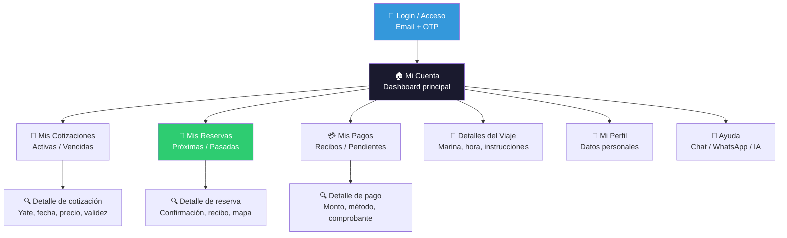
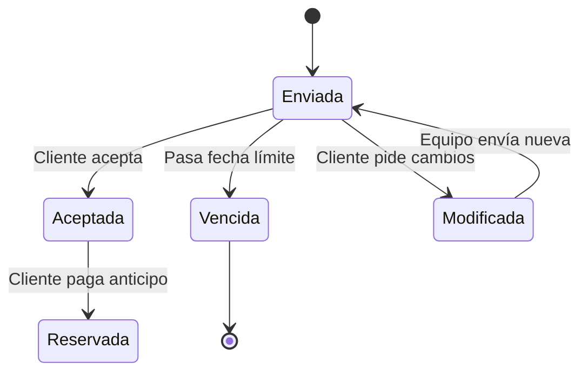
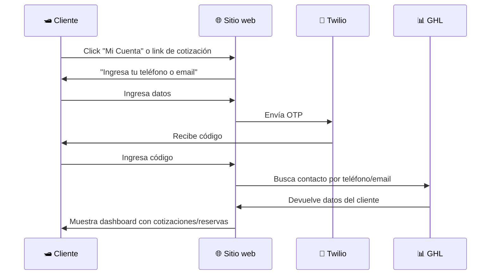

# Cuenta del cliente — Diseño funcional

> Documento de diseño · Issue [#12](https://github.com/YatezzitosMexico/yatezzitos-platform/issues/12)

---

## Objetivo

Diseñar una experiencia unificada donde el turista pueda ver sus cotizaciones, reservas, pagos y detalles de viaje en un solo lugar, sin depender de correos sueltos o mensajes de WhatsApp.

> **Decisión DEC-026:** La cuenta del cliente debe integrar cotizaciones y reservas en un mismo espacio.

---

## Problema actual

| Hoy | Impacto |
|---|---|
| La cotización se envía por email/WhatsApp | El cliente la pierde o no la encuentra |
| El recibo de depósito se envía como link/PDF | No está centralizado |
| El estatus de la reserva no es visible al cliente | Genera dudas y llamadas de seguimiento |
| No existe un portal donde el cliente vea todo | La experiencia se siente fragmentada |
| Los detalles del viaje llegan por múltiples canales | Información dispersa |

---

## Diagrama de la cuenta del cliente

---

## Secciones de la cuenta

### 1. Dashboard principal

Vista rápida al entrar a "Mi Cuenta":

| Elemento | Contenido |
|---|---|
| Saludo personalizado | "Hola, [nombre]. Bienvenido de vuelta." |
| Resumen de reserva próxima | Yate, fecha, ciudad, estatus |
| Acciones rápidas | Ver cotización / Ver reserva / Contactar equipo |
| Notificaciones | Cotización por vencer, pago pendiente, detalles del viaje |

---

### 2. Mis Cotizaciones

| Campo | Fuente (GHL) |
|---|---|
| Nombre del yate | `yacht_name` |
| Ciudad | Contacto / ficha |
| Fecha del viaje | `fecha_de_viaje` |
| Número de pasajeros | `number_of_passengers` |
| Precio total | `total_cost` |
| Anticipo requerido (50%) | `deposit_amount` |
| Estatus | `status_cotizacion` (activa / vencida / aceptada) |
| Fecha de validez | `fecha_de_compromiso_de_pago` |
| Link a la cotización | `quote_url` |
| Acción | "Aceptar y pagar" / "Solicitar cambios" |

**Estados de la cotización:**

---

### 3. Mis Reservas

| Campo | Fuente (GHL) |
|---|---|
| Nombre del yate | `yacht_name` |
| Imagen del yate | `imagen_principal_del_yate_upload` |
| Ciudad / destino | Contacto |
| Fecha del viaje | `fecha_de_viaje` |
| Hora de salida | `departure_time` |
| Hora de regreso | `return_time` |
| Duración | `duration_hours` |
| Número de pasajeros | `number_of_passengers` |
| Experiencia reservada | `experiencia_reservada` |
| Marina | `marina_name` |
| Link Google Maps | `google_maps_link` |
| Servicios incluidos | `servicios_adicionales_incluidos` |
| Inclusiones adicionales | `inclusiones_adicionales` |
| Características del yate | `caracteristicas_y_amenidades_del_yate` |
| Estatus de la reserva | `estado_de_la_reserva` |
| ID de reservación | `reservacion_id` |
| Link de reservación | `reservacion_url` |

**Estatus de la reserva:**
- 🟡 **Pendiente de pago** — Cotización aceptada, falta anticipo
- 🟠 **Anticipo recibido** — 50% pagado, recibo pendiente de envío
- 🟢 **Confirmada** — Anticipo pagado + recibo enviado
- 🔵 **Próxima** — Faltan menos de 48 horas para el viaje
- ✅ **Completada** — Viaje realizado
- ❌ **Cancelada** — Reserva cancelada

---

### 4. Mis Pagos

| Campo | Fuente (GHL) |
|---|---|
| Monto total | `total_cost` |
| Anticipo (50%) | `deposit_amount` |
| Saldo restante | `balance_due` |
| Método de pago | `payment_method` |
| Comprobante | `captura_de_pantalla_de_la_transferencia` |
| Estatus del pago | Calculado |

**Lo que ve el cliente:**
- Resumen de costos (total, anticipo, saldo)
- Histórico de pagos realizados
- Métodos de pago aceptados
- Botón "Pagar saldo restante" (cuando aplique)

---

### 5. Detalles del Viaje

Esta sección se activa cuando la reserva está **confirmada** y muestra todo lo que el cliente necesita para el día:

| Información | Contenido |
|---|---|
| Fecha y hora | Fecha del viaje, hora de salida y regreso |
| Marina / punto de encuentro | Nombre + dirección + link en Google Maps |
| Mapa interactivo | Ubicación de la marina |
| Qué llevar | Recomendaciones (protector solar, ropa cómoda, etc.) |
| Reglas a bordo | Seguridad, política de alcohol, niños, etc. |
| Contacto del capitán / equipo | Nombre + WhatsApp para el día del viaje |
| Servicios incluidos | Lista de lo que incluye la reserva |
| Estatus del clima | Enlace a pronóstico (futuro) |

---

### 6. Mi Perfil

| Campo | Editable |
|---|---|
| Nombre completo | ✅ |
| Email | ✅ (con verificación) |
| Teléfono / WhatsApp | ✅ |
| Idioma preferido | ✅ |
| País | ✅ |

---

### 7. Ayuda y soporte

| Canal | Disponibilidad |
|---|---|
| Chat con Yatezzitos IA (Marina) | 24/7 |
| WhatsApp directo | Horario comercial |
| Email | Siempre |
| FAQ / preguntas frecuentes | Siempre |

---

## Acceso a la cuenta

### Autenticación

| Método | Descripción | Prioridad |
|---|---|---|
| **Email + OTP** | El cliente ingresa su email, recibe código por SMS/email | ✅ Fase 1 |
| **WhatsApp OTP** | Verificación vía WhatsApp (ya existe Twilio) | ✅ Fase 1 |
| **Usuario + contraseña** | Registro tradicional | Fase 2 |
| **Login social** | Google, Facebook | Fase 2 |

> **Decisión DEC-036:** La integración actual con Twilio para OTP se mantiene y se aprovecha para la cuenta del cliente.

### Primer acceso

---

## Notificaciones al cliente

| Evento | Canal | Mensaje |
|---|---|---|
| Cotización enviada | Email + WhatsApp | "Tu cotización está lista. Revísala aquí." |
| Cotización por vencer | WhatsApp | "Tu cotización vence en 24 hrs." |
| Pago recibido | Email + WhatsApp | "Recibimos tu pago. Tu reserva está confirmada." |
| Recibo de depósito | Email | Recibo PDF + link a Mi Cuenta |
| 48 hrs antes del viaje | WhatsApp | Detalles: marina, hora, qué llevar |
| Día del viaje | WhatsApp | "Tu experiencia comienza hoy. ¡Buen viaje!" |
| Post-viaje | Email + WhatsApp | "Gracias. Cuéntanos tu experiencia." [Feedback] |

---

## Implementación por fases

### Fase 1 — Páginas dinámicas mejoradas (WordPress)
Aprovechar lo que ya existe:
- Mejorar las páginas dinámicas de cotización y reserva que ya leen datos de GHL
- Agregar acceso vía OTP (ya existe con Twilio)
- Mostrar: cotización, recibo, estatus, detalles del viaje
- No requiere login tradicional, solo verificación OTP

### Fase 2 — Portal completo en web app
- Dashboard con todas las secciones
- Historial completo de cotizaciones y reservas
- Pagos integrados
- Chat con IA (Marina)
- Notificaciones push
- Multi-idioma

---

## Relación con campos del CRM (GHL)

Todos los datos de la cuenta del cliente vienen de campos que ya existen en GoHighLevel:

| Sección de la cuenta | Carpeta GHL |
|---|---|
| Cotizaciones | Carpeta "Cotizaciones enviadas" |
| Reservas | Carpeta "Recibo de deposito" + "Datos de reserva" |
| Pagos | Carpeta "Recibo de deposito" |
| Perfil | Campos estándar de contacto |

> Esto significa que la Fase 1 puede construirse **sin crear nuevos campos**, solo leyendo mejor los que ya existen.

---

## Issues relacionados

| Issue | Relación |
|---|---|
| [#5 — Automatizar flujo comercial](https://github.com/YatezzitosMexico/yatezzitos-platform/issues/5) | Las automatizaciones alimentan la cuenta del cliente |
| [#6 — Etapa Feedback](https://github.com/YatezzitosMexico/yatezzitos-platform/issues/6) | Post-viaje se activa desde la cuenta |
| [#9 — Calendario](https://github.com/YatezzitosMexico/yatezzitos-platform/issues/9) | Disponibilidad se muestra en la cotización |
| [#11 — Marketplace](https://github.com/YatezzitosMexico/yatezzitos-platform/issues/11) | El cliente llega al marketplace y luego ve su cuenta |
| [#16 — IA turista](https://github.com/YatezzitosMexico/yatezzitos-platform/issues/16) | Chat con Marina integrado en la cuenta |

---

*Última actualización: 13 de marzo 2026*
