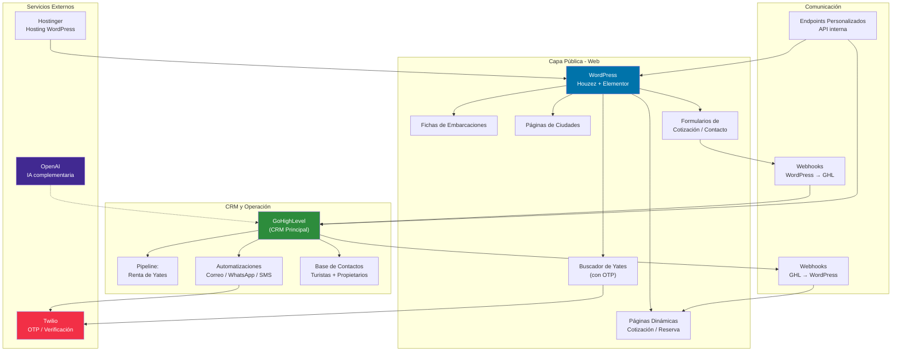
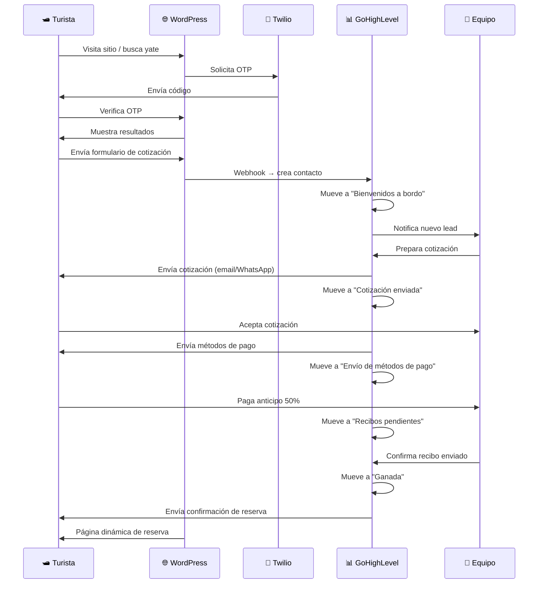

# Mapa de integraciones actuales — Yatezzitos Global

Este documento describe cómo se comunican todos los sistemas actuales del ecosistema Yatezzitos, qué datos fluyen entre ellos y cuáles son las dependencias críticas.

---

## Diagrama general del ecosistema

---

## Detalle de cada sistema

### 1. WordPress (Sitio web principal)

| Aspecto | Detalle |
|---|---|
| **URL** | yatezzitos.com |
| **Hosting** | Hostinger |
| **Tema** | Houzez (adaptado de bienes raíces a turismo náutico) |
| **Constructor** | Elementor |
| **Función** | Sitio comercial, SEO, fichas de yates, páginas de ciudades, formularios |
| **Se conecta con** | GoHighLevel (vía webhooks), Twilio (vía OTP) |

**Lo que maneja WordPress:**
- Fichas de embarcaciones (listings)
- Páginas de ciudades/destinos
- Buscador principal con verificación OTP
- Formularios de cotización y contacto
- Páginas dinámicas de cotización y reserva
- Blog y contenido SEO
- Landing pages (propietarios, servicios)

---

### 2. GoHighLevel (CRM principal)

| Aspecto | Detalle |
|---|---|
| **Función** | CRM, automatizaciones, comunicación, pipeline comercial |
| **Se conecta con** | WordPress (webhooks), Twilio (WhatsApp/SMS/OTP) |

**Lo que maneja GoHighLevel:**
- Base de contactos (turistas, propietarios, socios comerciales)
- Pipeline principal: "Renta de Yates"
  - Bienvenidos a bordo
  - Cotización enviada
  - Envío de métodos de pago
  - Recibos pendientes
  - Ganada (cliente pagó)
  - En espera / Prórroga
  - Pérdidas / No realizadas
- Automatizaciones de correo, WhatsApp y SMS
- Formularios conectados al sitio
- Campos personalizados
- Secuencias de seguimiento

---

### 3. Twilio

| Aspecto | Detalle |
|---|---|
| **Función** | Verificación OTP en buscador, envío de SMS/WhatsApp |
| **Se conecta con** | WordPress (buscador), GoHighLevel (automatizaciones) |

**Flujos que usa Twilio:**
- Buscador → usuario ingresa número → Twilio envía OTP → usuario verifica → ve resultados
- GHL → automatización dispara → Twilio envía WhatsApp/SMS al cliente

---

### 4. Webhooks (WordPress ↔ GoHighLevel)

| Dirección | Qué dispara | Qué hace |
|---|---|---|
| **WordPress → GHL** | Envío de formulario de cotización/contacto | Crea o actualiza contacto en GHL, lo mueve al pipeline |
| **GHL → WordPress** | Cambio de etapa en pipeline / dato actualizado | Actualiza página dinámica de cotización/reserva |

⚠️ **Por confirmar:** Los webhooks específicos activos y sus URLs exactas. Se recomienda auditar periódicamente.

---

### 5. Endpoints / Lógica personalizada

| Aspecto | Detalle |
|---|---|
| **Función** | Mostrar información dinámica de cotizaciones y reservas |
| **Tecnología** | PHP personalizado dentro de WordPress (plugin/mu-plugin) |
| **Se conecta con** | GoHighLevel (lee datos del CRM y los muestra en WordPress) |

**Páginas que usan endpoints personalizados:**
- Página de cotización personalizada (muestra datos del lead)
- Página de reserva/confirmación
- Página de agradecimiento post-pago
- Páginas con tokens o parámetros de URL que leen datos del CRM

---

### 6. OpenAI

| Aspecto | Detalle |
|---|---|
| **Función** | Herramientas complementarias de IA (⚠️ En definición) |
| **Se conecta con** | GoHighLevel, herramientas internas |

⚠️ **Por confirmar:** Integración exacta con OpenAI. Ver `ai/assistants/` para specs de agentes IA futuros.

---

## Flujo comercial completo

---

## Dependencias críticas

| Si falla... | Se afecta... | Severidad |
|---|---|---|
| WordPress / Hostinger | Todo el sitio público, SEO, formularios | 🔴 Crítica |
| GoHighLevel | CRM, pipeline, automatizaciones, comunicación | 🔴 Crítica |
| Twilio | Buscador OTP, WhatsApp, SMS | 🟠 Alta |
| Webhooks WP→GHL | Registro automático de leads | 🟠 Alta |
| Webhooks GHL→WP | Páginas dinámicas de cotización/reserva | 🟡 Media |
| Endpoints personalizados | Información personalizada al cliente | 🟡 Media |

---

## Puntos de mejora identificados

1. **Auditar webhooks activos** — Documentar URLs exactas y payloads
2. **Documentar endpoints personalizados** — Qué plugins/mu-plugins existen y qué hacen
3. **Mejorar monitoreo** — Actualmente no hay alertas si un webhook falla
4. **Separar datos** — Turistas vs propietarios están mezclados en GHL
5. **Preparar para web app** — Los endpoints actuales podrían evolucionar a una API REST formal

---

## Relación con issues del backlog

| Área | Issue relacionado |
|---|---|
| Ordenar CRM / GHL | [#4 — Ordenar el CRM actual](https://github.com/YatezzitosMexico/yatezzitos-platform/issues/4) |
| Automatizar flujo comercial | [#5 — Automatizar flujo comercial](https://github.com/YatezzitosMexico/yatezzitos-platform/issues/5) |
| Calendario de disponibilidad | [#9 — Calendario de disponibilidad](https://github.com/YatezzitosMexico/yatezzitos-platform/issues/9) |
| Arquitectura web app | [#15 — Arquitectura web app](https://github.com/YatezzitosMexico/yatezzitos-platform/issues/15) |

---

*Última actualización: 13 de marzo 2026*
