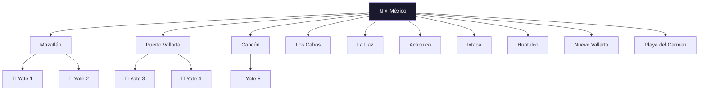
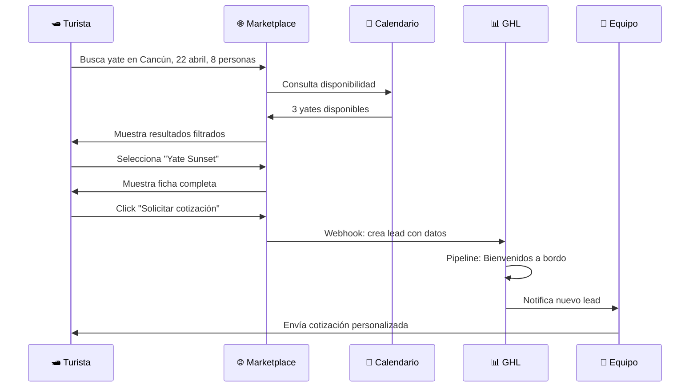

# Marketplace de yates — Diseño funcional

> Documento de diseño · Issue [#11](https://github.com/YatezzitosMexico/yatezzitos-platform/issues/11)

---

## Objetivo

Diseñar cómo funcionará el marketplace de yates como producto principal del negocio: búsqueda, filtros, disponibilidad, cotización y reserva.

El marketplace es la **prioridad #1 de producto** (DEC-008) y debe convertirse en la experiencia central para que turistas encuentren, comparen y reserven embarcaciones.

---

## Flujo del usuario en el marketplace


---

## Filtros de búsqueda

El turista debe poder encontrar la embarcación ideal de forma rápida e intuitiva.

### Filtros principales (visibles siempre)

| Filtro | Tipo | Valores |
|---|---|---|
| **Destino / Ciudad** | Dropdown / Autocomplete | Mazatlán, Puerto Vallarta, Cancún, Los Cabos, etc. |
| **Fecha del viaje** | Date picker | Fecha deseada (conecta con calendario de disponibilidad) |
| **Número de pasajeros** | Selector numérico | 1 – 50+ |
| **Tipo de embarcación** | Multi-select | Yate, catamarán, velero, lancha, panga, mega yate |

### Filtros secundarios (expandibles)

| Filtro | Tipo | Valores |
|---|---|---|
| **Rango de precio** | Slider / rango | $X,000 – $XX,000 MXN / USD |
| **Duración** | Multi-select | 4 hrs, 6 hrs, 8 hrs, 10 hrs, overnight |
| **Disponibilidad** | Toggle | Solo mostrar yates disponibles en la fecha seleccionada |
| **Características** | Multi-select | Con dormitorios, con baño, con cocina, con toldo, etc. |
| **Tipo de experiencia** | Multi-select | Paseo, fiesta, pesca, sunset, whale watching, overnight (futuro) |

> **Nota:** El filtro de "Tipo de experiencia" se integrará como filtro secundario una vez que la categorización de experiencias esté organizada. La prioridad actual es filtrar por tipo de embarcación.

### Ordenar resultados por

| Criterio | Dirección |
|---|---|
| Precio | Menor a mayor / Mayor a menor |
| Popularidad | Más reservados primero |
| Relevancia | Por defecto (match con filtros) |
| Capacidad | Mayor a menor |

---

## Lógica de ciudades / destinos



### Jerarquía de contenido

```
País
└── Ciudad / Destino
    ├── Página de ciudad (SEO madre)
    └── Embarcaciones
        ├── Ficha de yate 1 (keyword única)
        ├── Ficha de yate 2 (keyword única)
        └── Ficha de yate N
```

### Reglas de ciudades
- Cada ciudad tiene una **página madre** optimizada para SEO (DEC-041)
- Cada embarcación tiene una **keyword única** sin canibalizar la página madre
- Solo se muestran ciudades con al menos 1 embarcación activa
- Las ciudades se organizan por relevancia/volumen, no alfabéticamente

---

## Lógica de embarcaciones

### Vista de tarjeta (resultados de búsqueda)

Cada yate en la lista de resultados muestra:

| Elemento | Fuente (WordPress) |
|---|---|
| Imagen destacada | `imagen_destacada` |
| Título | `titulo_del_anuncio` |
| Ciudad | `ciudad` |
| Tipo de embarcación | `tipo_de_embarcacion` |
| Capacidad | `numero_de_pasajeros` pasajeros |
| Precio desde | `precio_venta_o_alquiler` + `tipo_de_divisa` |
| Duración | `duracion_del_alquiler` |
| Badge de disponibilidad | 🟢 / 🔴 (del calendario) |
| Botón | "Ver detalles" / "Cotizar" |

### Vista de ficha (página del yate)

Cada embarcación tiene su página completa con:

| Sección | Contenido | Fuente |
|---|---|---|
| Galería | Fotos del yate (slider/carousel) | `galeria_de_imagenes` |
| Título y ubicación | Nombre + ciudad + mapa | `titulo_del_anuncio` + `ciudad` |
| Descripción | Texto completo | `descripcion_y_contenido` |
| Detalles técnicos | Pasajeros, dormitorios, baños, año | Campos de detalle |
| Precio | Desde $X por Y horas | `precio_venta_o_alquiler` + `duracion_del_alquiler` |
| Tipo de embarcación | Yate, catamarán, velero, etc. | `tipo_de_embarcacion` |
| Disponibilidad | Mini-calendario o badge | Calendario de disponibilidad |
| Recorrido virtual | Video o 360° | `url_del_video` / `recorrido_virtual_iframe` |
| CTA principal | "Solicitar cotización" | Formulario → GHL |
| Perfil del propietario | Nombre, foto, contacto | `author_usuario_asignado` |
| Embarcaciones similares | Recomendaciones | Misma ciudad o tipo |

---

## Relación con disponibilidad

| Escenario | Comportamiento del marketplace |
|---|---|
| Turista NO selecciona fecha | Muestra todos los yates de la ciudad |
| Turista selecciona fecha | Solo muestra yates con 🟢 disponible o sin bloqueo |
| Yate está 🔴 Reservado | Se muestra pero con badge "No disponible en esta fecha" |
| Yate está ⚫ Bloqueado | Igual que reservado |
| Yate está 🟡 Cotizado | Se sigue mostrando (aún no está confirmado) |

Ver [Issue #9 — Calendario de disponibilidad](https://github.com/YatezzitosMexico/yatezzitos-platform/issues/9) para el diseño completo del calendario.

---

## Relación con cotización y reserva



### Datos que envía el formulario de cotización

| Campo | Fuente |
|---|---|
| Nombre del turista | Formulario |
| Email | Formulario |
| Teléfono / WhatsApp | Formulario |
| Yate seleccionado | Automático (del listing) |
| Ciudad / destino | Automático |
| Fecha deseada | Formulario o filtro previo |
| Número de pasajeros | Formulario o filtro previo |
| Tipo de embarcación | Automático (del listing) |
| Mensaje adicional | Formulario (opcional) |

---

## UX de búsqueda

### Vista de resultados

| Opción | Descripción |
|---|---|
| **Grid** (por defecto) | Tarjetas en cuadrícula, visual y premium |
| **Lista** | Más compacta, útil para comparar rápido |
| **Mapa** | Muestra yates geolocalizados en la ciudad |

### Experiencia móvil
- Filtros colapsables en la parte superior
- Tarjetas verticales de ancho completo
- Swipe en galería de fotos
- Botón flotante de "Cotizar por WhatsApp"
- Carga lazy de imágenes

### Búsqueda inteligente (futuro con IA)
Con Yatezzitos IA integrado, el turista podrá escribir:

> *"Quiero un yate para 12 personas en Puerto Vallarta el 5 de mayo"*

Y la IA interpreta los filtros automáticamente.

---

## SEO del marketplace

| Página | URL sugerida | Keyword objetivo |
|---|---|---|
| Marketplace home | `/renta-de-yates/` | renta de yates en méxico |
| Página de ciudad | `/renta-de-yates/cancun/` | renta de yates en cancún |
| Ficha de yate | `/renta-de-yates/cancun/yate-sunset/` | [keyword única del yate] |

### Reglas SEO del marketplace
- Cada página tiene **title tag y meta description únicos**
- No hay dos páginas compitiendo por la misma keyword
- El enlazado interno conecta: ciudad → yates
- Las fichas incluyen schema markup (Product, Offer, AggregateRating)

Ver [docs/seo/](../seo/) para más detalle.

---

## Implementación por fases

### Fase 1 — Mejorar lo actual en WordPress
No construir desde cero, sino mejorar la búsqueda y fichas actuales:
- Mejorar filtros del buscador de Houzez
- Agregar filtro principal por tipo de embarcación
- Mejorar diseño de tarjetas de resultados
- Completar fichas con todos los campos
- Agregar badge de disponibilidad
- Mejorar formulario de cotización

### Fase 2 — Marketplace en web app
Cuando la web app exista:
- Búsqueda con filtros avanzados y mapa
- Disponibilidad en tiempo real integrada
- Cotización instantánea
- Comparación de yates
- Filtro por tipo de experiencia (cuando esté organizado)
- Recomendaciones con IA
- Multi-idioma y multi-moneda

---

## Issues relacionados

| Issue | Relación |
|---|---|
| [#2 — Rediseño web](https://github.com/YatezzitosMexico/yatezzitos-platform/issues/2) | El rediseño define cómo se ve el marketplace en WordPress |
| [#3 — SEO ciudades](https://github.com/YatezzitosMexico/yatezzitos-platform/issues/3) | Las páginas de ciudad son la estructura del marketplace |
| [#9 — Calendario](https://github.com/YatezzitosMexico/yatezzitos-platform/issues/9) | La disponibilidad es filtro clave del marketplace |
| [#12 — Cuenta del cliente](https://github.com/YatezzitosMexico/yatezzitos-platform/issues/12) | El cliente verá sus cotizaciones/reservas del marketplace |
| [#15 — Arquitectura web app](https://github.com/YatezzitosMexico/yatezzitos-platform/issues/15) | El marketplace será el módulo principal de la web app |
| [#16 — IA turista](https://github.com/YatezzitosMexico/yatezzitos-platform/issues/16) | Búsqueda inteligente con IA |

---

*Última actualización: 13 de marzo 2026*
