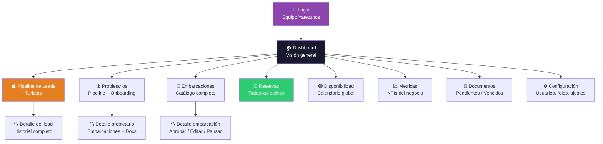
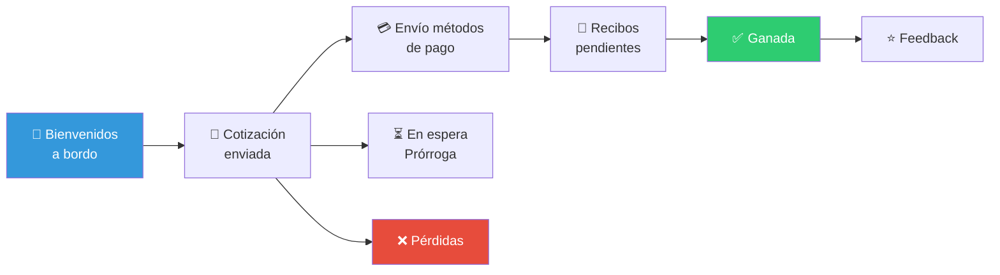

# Panel interno del equipo — Diseño funcional

> Documento de diseño · Issue [#14](https://github.com/YatezzitosMexico/yatezzitos-platform/issues/14)

---

## Objetivo

Diseñar el panel de operación interna donde el equipo de Yatezzitos gestiona leads, cotizaciones, reservas, propietarios, embarcaciones y toda la operación del negocio con visibilidad total.

Este panel es la **herramienta de productividad central** del equipo. Debe reducir procesos manuales, dar visibilidad en tiempo real y centralizar la operación que hoy está dispersa entre GHL, WordPress y WhatsApp.

---

## Quién usa el panel interno

| Rol interno | Qué necesita |
|---|---|
| **Director / CEO** | Visión general del negocio, métricas, decisiones |
| **Vendedor / Asesor** | Gestionar leads, enviar cotizaciones, dar seguimiento |
| **Operaciones** | Coordinar reservas, propietarios, disponibilidad |
| **Marketing / SEO** | Ver rendimiento de contenido, tráfico, conversión |
| **Soporte** | Atender consultas, resolver problemas |

---

## Diagrama del panel

---

## Secciones del panel

### 1. Dashboard — Visión general

Métricas clave del día/semana/mes:

| Métrica | Descripción | Fuente |
|---|---|---|
| Leads nuevos hoy | Cuántos leads entraron | GHL Pipeline |
| Cotizaciones enviadas | Cuántas cotizaciones se mandaron | GHL |
| Reservas confirmadas | Cuántas reservas activas | GHL |
| Ingresos del mes | Total de reservas ganadas | GHL |
| Reservas próximas (7 días) | Viajes que salen esta semana | GHL |
| Embarcaciones activas | Total publicadas en el marketplace | WordPress |
| Propietarios en onboarding | Cuántos están en proceso | GHL Pipeline |
| Documentos por vencer | Permisos/seguros próximos a expirar | Sistema |
| Feedback pendiente | Viajes completados sin reseña | GHL |

---

### 2. Pipeline de Leads (Turistas)

Vista del pipeline actual de "Renta de Yates" con todas las etapas:

**Lo que ve el equipo por cada lead:**

| Campo | Fuente GHL |
|---|---|
| Nombre completo | `first_name` + `last_name` |
| Teléfono / WhatsApp | `phone` / `whatsapp` |
| Email | `email` |
| Ciudad / destino | Campo libre / contacto |
| Fecha de viaje | `fecha_de_viaje` |
| Yate de interés | `yacht_name` / `url_del_yate` |
| Pasajeros | `number_of_passengers` |
| Etapa actual | Pipeline stage |
| Días en la etapa | Calculado |
| Último contacto | Fecha del último mensaje/llamada |
| Historial de interacciones | Notas, mensajes, llamadas |

**Acciones rápidas:**
- Mover de etapa
- Enviar cotización
- Enviar WhatsApp
- Registrar nota/llamada
- Asignar a otro vendedor

---

### 3. Pipeline de Propietarios

Vista del pipeline de captación de propietarios:

| Etapa | Acción principal del equipo |
|---|---|
| Bienvenida | Hacer primer contacto en < 24 hrs |
| Contactado | Enviar encuesta / explicar proceso |
| Encuesta enviada | Esperar datos del propietario |
| Documentos recibidos ⚠️ | Revisar documentos con checklist |
| En revisión ⚠️ | Aprobar o solicitar correcciones |
| Subido al sitio web | Embarcación publicada ✅ |

Ver flujo completo en [Onboarding de propietarios](../crm/onboarding-propietarios.md).

---

### 4. Catálogo de Embarcaciones

Vista completa de todas las embarcaciones del marketplace:

| Campo | Fuente |
|---|---|
| Título | `titulo_del_anuncio` |
| Ciudad | `ciudad` |
| Tipo | `tipo_de_embarcacion` |
| Propietario | `author_usuario_asignado` |
| Precio | `precio_venta_o_alquiler` |
| Capacidad | `numero_de_pasajeros` |
| Estado | Publicado / Borrador / En revisión / Pausado |
| Reservas (mes) | Calculado |
| Documentos | ✅ Completos / ⚠️ Incompletos |

**Acciones del equipo:**
- Aprobar publicación (DEC-031)
- Pausar embarcación
- Editar cualquier campo
- Cambiar propietario asignado
- Ver historial de cambios

**Filtros:**
- Por ciudad
- Por tipo de embarcación
- Por propietario
- Por estado (publicado, borrador, pausado)
- Por documentos (completos vs incompletos)

---

### 5. Reservas

Vista centralizada de todas las reservas del negocio:

| Campo | Fuente |
|---|---|
| Cliente | Nombre del lead |
| Yate | `yacht_name` |
| Ciudad | Del listing |
| Fecha | `fecha_de_viaje` |
| Hora salida / regreso | `departure_time` / `return_time` |
| Pasajeros | `number_of_passengers` |
| Marina | `marina_name` |
| Monto total | `total_cost` |
| Anticipo | `deposit_amount` |
| Saldo | `balance_due` |
| Estatus | `estado_de_la_reserva` |
| Vendedor asignado | Del contacto GHL |

**Vistas:**
- **Hoy:** Viajes del día
- **Esta semana:** Próximos 7 días
- **Calendario:** Vista mensual de todas las reservas
- **Histórico:** Reservas pasadas

---

### 6. Disponibilidad Global

Calendario maestro donde el equipo ve la disponibilidad de **todas** las embarcaciones:

| Vista | Descripción |
|---|---|
| Por embarcación | Calendario individual |
| Por ciudad | Todas las embarcaciones de una ciudad |
| Vista global | Matriz: embarcaciones × fechas |

**Acciones del equipo:**
- Bloquear/desbloquear fechas de cualquier embarcación
- Ver qué está cotizado vs reservado
- Buscar disponibilidad rápida para un lead

Ver [Calendario de disponibilidad](calendario-disponibilidad.md).

---

### 7. Métricas y reportes

**Ventas:**

| Métrica | Descripción |
|---|---|
| Leads por canal | Cuántos llegan por SEO, ads, referido, WhatsApp |
| Tasa de conversión | Leads → cotizaciones → reservas |
| Ticket promedio | Monto promedio por reserva |
| Ingresos por mes | Total acumulado |
| Ingresos por ciudad | Qué destinos generan más |
| Ingresos por embarcación | Qué yates generan más |
| Tiempo promedio de cierre | Lead nuevo → reserva confirmada |

**Operación:**

| Métrica | Descripción |
|---|---|
| Tasa de ocupación por yate | % de días reservados |
| Propietarios activos vs inactivos | Quiénes operan vs quiénes no |
| Documentos vencidos | Cuántos necesitan renovación |
| Tiempo de onboarding | Registro → publicación |
| Reservas canceladas | Tasa de cancelación |

**SEO / Marketing:**

| Métrica | Descripción |
|---|---|
| Tráfico por ciudad | Visitas a páginas de ciudad |
| Rankings de keywords | Posición de keywords objetivo |
| Páginas más visitadas | Qué fichas generan más tráfico |
| Conversión por página | Visitas → cotizaciones |

> Las métricas de marketing son **Fase 2/3**. En Fase 1, las métricas de ventas y operación vienen de GHL.

---

### 8. Configuración

| Sección | Funcionalidad |
|---|---|
| Usuarios del equipo | Crear, editar, desactivar accesos |
| Roles y permisos | Definir qué ve/hace cada rol |
| Ciudades activas | Gestionar destinos del marketplace |
| Tipos de embarcación | Gestionar categorías |
| Plantillas de cotización | Mensajes predefinidos |
| Webhooks | Configurar conexiones GHL ↔ WP |
| Integraciones | Estado de Twilio, GHL, OpenAI |

---

## Diferencia entre panel interno y panel de propietarios

| Aspecto | Panel Propietarios (#13) | Panel Interno (#14) |
|---|---|---|
| **Quién lo usa** | Propietarios, brokers, agencias | Equipo Yatezzitos |
| **Ve embarcaciones de** | Solo las suyas | Todas |
| **Ve datos del cliente** | Solo operativos (fecha, pasajeros) | Todo (contacto, pagos, historial) |
| **Edita** | Su perfil + sus embarcaciones | Todo |
| **Aprueba publicaciones** | No | Sí |
| **Ve métricas globales** | Solo las suyas | Todo el negocio |
| **Pipeline** | No | Pipeline completo de turistas y propietarios |
| **Configuración** | Su perfil | Todo el sistema |

---

## Implementación por fases

### Fase 1 — GoHighLevel optimizado
No construir panel desde cero. Mejorar el uso actual de GHL:
- Documentar procesos para cada etapa del pipeline
- Estandarizar uso de campos
- Crear vistas y reportes dentro de GHL
- Mejorar dashboard de WordPress para aprobaciones

### Fase 2 — Panel básico en web app
- Dashboard con KPIs principales
- Vista de reservas centralizada
- Calendario global de disponibilidad
- Aprobación de embarcaciones

### Fase 3 — Panel avanzado
- Métricas y reportes completos
- Gestión de contenido SEO
- Automatizaciones visuales
- IA de soporte interno integrada

---

## Issues relacionados

| Issue | Relación |
|---|---|
| [#4 — Ordenar CRM](https://github.com/YatezzitosMexico/yatezzitos-platform/issues/4) | Ordenar GHL es prerequisito del panel |
| [#5 — Automatizar flujo](https://github.com/YatezzitosMexico/yatezzitos-platform/issues/5) | Las automatizaciones se visualizan desde el panel |
| [#9 — Calendario](https://github.com/YatezzitosMexico/yatezzitos-platform/issues/9) | Disponibilidad global dentro del panel |
| [#13 — Panel propietarios](https://github.com/YatezzitosMexico/yatezzitos-platform/issues/13) | Versión externa del panel |
| [#15 — Web app](https://github.com/YatezzitosMexico/yatezzitos-platform/issues/15) | El panel se construye dentro de la web app |
| [#18 — IA soporte interno](https://github.com/YatezzitosMexico/yatezzitos-platform/issues/18) | IA asiste al equipo desde el panel |

---

*Última actualización: 13 de marzo 2026*
