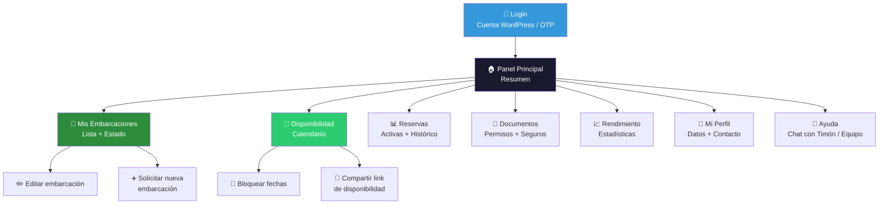
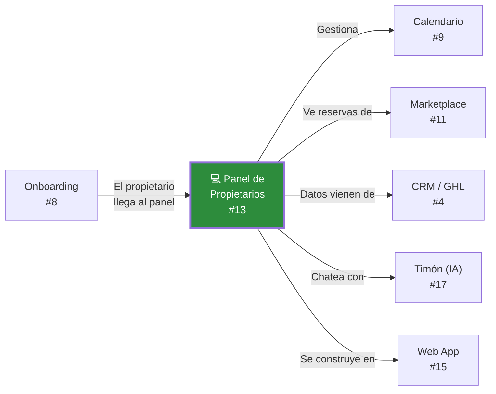

# Panel de propietarios — Diseño funcional

> Documento de diseño · Issue [#13](https://github.com/YatezzitosMexico/yatezzitos-platform/issues/13)

---

## Objetivo

Diseñar el panel donde propietarios, administradores, brokers y agencias gestionen sus embarcaciones, disponibilidad, documentos, reservas y rendimiento dentro del ecosistema Yatezzitos.

Este panel es la **prioridad #2 de producto** después del marketplace (DEC-008) porque sin propietarios organizados no hay oferta escalable.

---

## A quién sirve este panel

| Rol | Qué necesita |
|---|---|
| **Propietario directo** | Gestionar su(s) embarcación(es), ver reservas, actualizar disponibilidad |
| **Administrador** | Gestionar embarcaciones de terceros, documentación, comunicación |
| **Broker** | Ver embarcaciones asignadas, compartir disponibilidad, referir clientes |
| **Agencia** | Gestionar flota, múltiples embarcaciones, reportes |
| **Capitán** | Ver reservas asignadas, detalles del viaje (futuro) |

> **Campo clave:** `rol_de_usuario` — determina qué ve y qué puede hacer cada quien.

---

## Diagrama del panel

---

## Secciones del panel

### 1. Dashboard — Resumen rápido

Al entrar, el propietario ve:

| Elemento | Contenido |
|---|---|
| Saludo | "Bienvenido, [nombre]. Aquí está tu resumen." |
| Embarcaciones activas | Número de embarcaciones publicadas |
| Próxima reserva | Fecha, yate, pasajeros |
| Disponibilidad pendiente | Fechas sin actualizar (alerta) |
| Documentos por vencer | Permisos/seguros próximos a expirar |
| Ingresos del mes | Total de reservas confirmadas (futuro) |

---

### 2. Mis Embarcaciones

Lista de todas las embarcaciones vinculadas al propietario (`author_usuario_asignado`).

**Vista de tarjeta por embarcación:**

| Campo | Fuente WordPress |
|---|---|
| Imagen destacada | `imagen_destacada` |
| Título | `titulo_del_anuncio` |
| Ciudad | `ciudad` |
| Tipo | `tipo_de_embarcacion` |
| Capacidad | `numero_de_pasajeros` |
| Precio | `precio_venta_o_alquiler` |
| Estado de publicación | Publicado / Borrador / En revisión |
| Número de reservas (mes) | Calculado |

**Acciones disponibles:**

| Acción | Quién puede | Nota |
|---|---|---|
| Ver ficha pública | Todos | Link directo a yatezzitos.com |
| Editar información | Propietario, Admin | Cambios pasan por revisión |
| Actualizar fotos | Propietario, Admin | Mínimo 5 fotos |
| Solicitar nueva embarcación | Todos | Inicia flujo de onboarding |
| Pausar publicación | Propietario, Admin | Temporalmente fuera del marketplace |

> **Regla DEC-031:** Toda modificación significativa (precio, descripción, fotos) pasa por revisión interna antes de publicarse.

---

### 3. Disponibilidad / Calendario

Ver documento completo: [Calendario de disponibilidad](calendario-disponibilidad.md)

**Lo que ve el propietario:**

| Elemento | Funcionalidad |
|---|---|
| Vista mensual del calendario | Una embarcación a la vez o todas juntas |
| Colores por estatus | 🟢 Disponible · 🟡 Cotizado · 🔴 Reservado · ⚫ Bloqueado |
| Bloquear fechas | Seleccionar rango + motivo |
| Desbloquear fechas | Solo si no están reservadas |
| Compartir link | Genera URL pública de disponibilidad |

**Permisos del calendario por rol:**

| Acción | Propietario | Admin | Broker | Agencia |
|---|---|---|---|---|
| Ver calendario | ✅ (sus yates) | ✅ (todos) | ✅ (asignados) | ✅ (su flota) |
| Bloquear fechas | ✅ | ✅ | ❌ | ✅ |
| Desbloquear | ✅ (no reservadas) | ✅ | ❌ | ✅ (no reservadas) |
| Compartir link | ✅ | ✅ | ✅ | ✅ |

---

### 4. Reservas

El propietario ve las reservas de sus embarcaciones:

| Campo | Fuente |
|---|---|
| Fecha del viaje | `fecha_de_viaje` |
| Nombre del cliente | Nombre del contacto (solo primer nombre) |
| Número de pasajeros | `number_of_passengers` |
| Duración | `duration_hours` |
| Hora de salida | `departure_time` |
| Marina | `marina_name` |
| Estatus | `estado_de_la_reserva` |
| Experiencia | `experiencia_reservada` |

> **Privacidad:** El propietario NO ve datos de contacto completos del turista (teléfono, email, pago). Solo ve lo operativo necesario.

**Filtros de reservas:**
- Próximas / Pasadas / Todas
- Por embarcación
- Por mes

---

### 5. Documentos

Gestión de documentos requeridos (ver [Onboarding de propietarios](../crm/onboarding-propietarios.md)):

| Documento | Estado posible | Alerta |
|---|---|---|
| Identificación oficial (INE/Pasaporte) | ✅ Vigente / ❌ Faltante | Si falta |
| Permiso de navegación | ✅ Vigente / ⚠️ Por vencer / ❌ Vencido | 30 días antes de vencer |
| Seguro de embarcación | ✅ Vigente / ⚠️ Por vencer / ❌ Vencido | 30 días antes de vencer |
| Fotos profesionales | ✅ Completas / ⚠️ Incompletas | Si < 5 fotos |
| Acta constitutiva | ✅ / N/A | Solo personas morales |
| Contrato de administración | ✅ / N/A | Solo administradores |

**Acciones:**
- Subir documento nuevo
- Reemplazar documento vencido
- Ver historial de documentos

**Automatización futura:** Notificación automática cuando un documento está por vencer.

---

### 6. Rendimiento / Estadísticas

**Métricas que verá el propietario (futuro):**

| Métrica | Descripción |
|---|---|
| Reservas del mes | Total de reservas confirmadas |
| Tasa de ocupación | % de días reservados vs disponibles |
| Ingresos estimados | Total por reservas (si aplica) |
| Vistas de la ficha | Cuántas veces se vio la embarcación |
| Cotizaciones recibidas | Cuántos leads preguntaron por esta embarcación |
| Conversión | Cotizaciones → reservas |

> Esta sección es de **Fase 2**. En Fase 1, el propietario solo ve reservas y disponibilidad.

---

### 7. Mi Perfil

El propietario edita sus datos desde aquí (mismos campos de WordPress/Houzez):

| Campo | Editable |
|---|---|
| Foto de perfil | ✅ |
| Nombre / Apellido | ✅ |
| Nombre público | ✅ |
| Nombre de la empresa | ✅ |
| Teléfono / WhatsApp | ✅ |
| Email | ✅ (con verificación) |
| Sobre mí | ✅ |
| Redes sociales | ✅ |
| Áreas de servicio | ✅ |
| Contraseña | ✅ |

Ver lista completa de campos en [Onboarding de propietarios](../crm/onboarding-propietarios.md).

---

### 8. Ayuda y soporte

| Canal | Agente IA | Disponibilidad |
|---|---|---|
| Chat integrado | Timón (asistente IA propietario) | 24/7 |
| WhatsApp | Equipo Yatezzitos | Horario comercial |
| Email | Equipo Yatezzitos | Siempre |
| Centro de ayuda | FAQ + guías | Siempre |

Ver [Issue #17 — Asistente IA propietarios](https://github.com/YatezzitosMexico/yatezzitos-platform/issues/17).

---

## Acceso al panel

### Dónde vive el panel hoy

En la Fase 1, el panel es el **dashboard de Houzez** dentro de WordPress, que ya permite:
- Ver listings propios
- Editar embarcaciones
- Gestionar perfil

### Qué se agrega en Fase 1
- Vista de calendario de disponibilidad
- Sección de documentos
- Link compartible de disponibilidad
- Mejora visual del dashboard

### Fase 2 — Panel en web app
- Dashboard completo con estadísticas
- Notificaciones de reservas
- Chat con Timón
- Gestión multi-embarcación avanzada
- Reportes de rendimiento

---

## Permisos por rol

| Funcionalidad | Propietario | Admin | Broker | Agencia | Capitán |
|---|---|---|---|---|---|
| Ver sus embarcaciones | ✅ | ✅ (todas) | ✅ (asignadas) | ✅ (su flota) | ❌ |
| Editar embarcaciones | ✅ | ✅ | ❌ | ✅ | ❌ |
| Ver calendario | ✅ | ✅ | ✅ | ✅ | ❌ |
| Bloquear fechas | ✅ | ✅ | ❌ | ✅ | ❌ |
| Compartir link disp. | ✅ | ✅ | ✅ | ✅ | ❌ |
| Ver reservas | ✅ | ✅ | ✅ (lectura) | ✅ | ✅ (solo asignadas) |
| Subir documentos | ✅ | ✅ | ❌ | ✅ | ❌ |
| Ver estadísticas | ✅ | ✅ | ❌ | ✅ | ❌ |
| Editar perfil | ✅ | ✅ | ✅ | ✅ | ✅ |
| Solicitar nueva emb. | ✅ | ✅ | ✅ | ✅ | ❌ |

---

## Relación con otros documentos

---

## Issues relacionados

| Issue | Relación |
|---|---|
| [#8 — Onboarding propietarios](https://github.com/YatezzitosMexico/yatezzitos-platform/issues/8) | El onboarding es la puerta de entrada al panel |
| [#9 — Calendario](https://github.com/YatezzitosMexico/yatezzitos-platform/issues/9) | El calendario vive dentro del panel |
| [#11 — Marketplace](https://github.com/YatezzitosMexico/yatezzitos-platform/issues/11) | Las embarcaciones del panel se muestran en el marketplace |
| [#14 — Panel interno](https://github.com/YatezzitosMexico/yatezzitos-platform/issues/14) | El equipo ve lo mismo pero con más permisos |
| [#15 — Web app](https://github.com/YatezzitosMexico/yatezzitos-platform/issues/15) | El panel migra a la web app en Fase 2 |
| [#17 — IA propietarios](https://github.com/YatezzitosMexico/yatezzitos-platform/issues/17) | Timón asiste al propietario desde el panel |

---

*Última actualización: 13 de marzo 2026*
