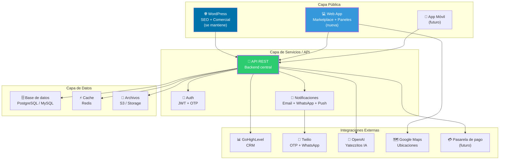
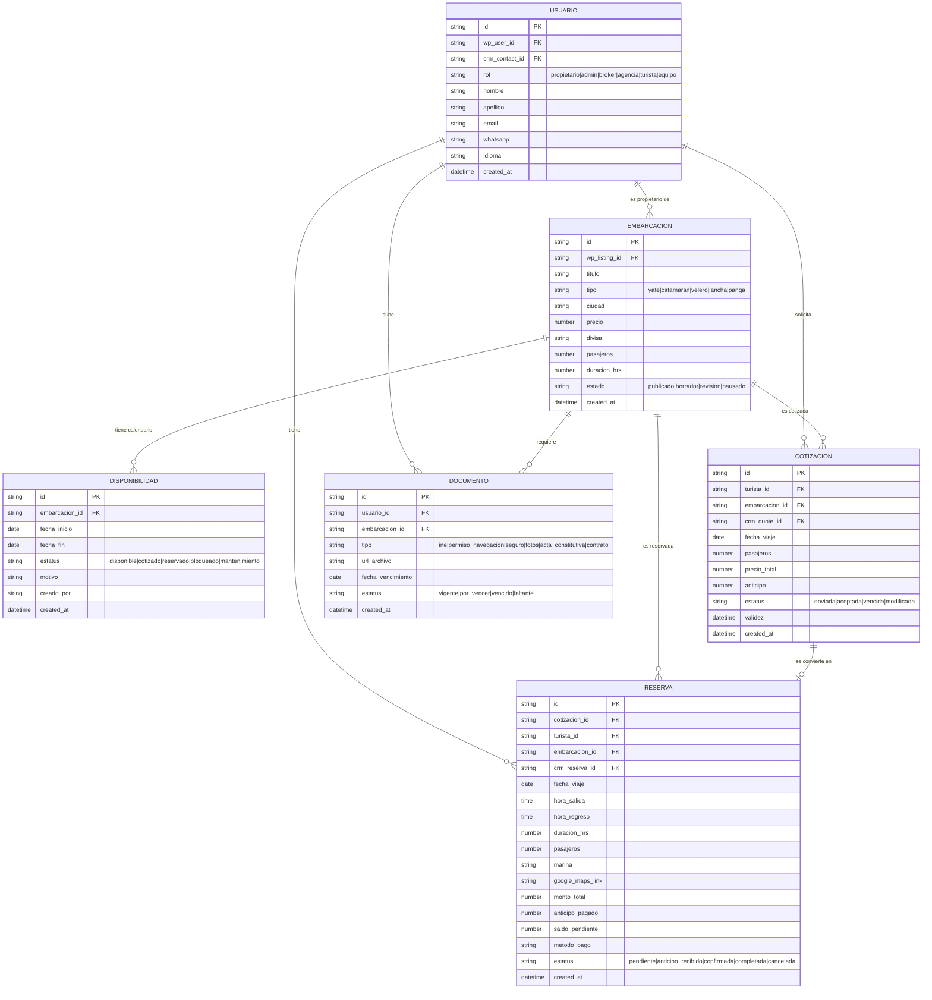
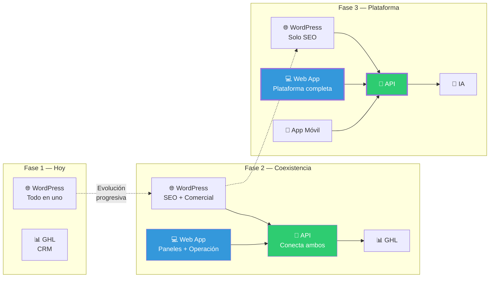

# Arquitectura de la web app — Diseño técnico

> Documento de arquitectura · Issue [#15](https://github.com/YatezzitosMexico/yatezzitos-platform/issues/15)

---

## Objetivo

Definir la arquitectura técnica de la futura web app de Yatezzitos Global: una plataforma separada de WordPress que concentre la operación avanzada del negocio (marketplace, paneles, disponibilidad, reservas, IA).

---

## Principios de arquitectura

| Principio | Descripción |
|---|---|
| **No romper producción** | WordPress sigue activo durante y después de la transición (DEC-004) |
| **Modular** | Cada módulo funciona independiente pero se conecta con los demás |
| **API-first** | Todo dato se expone vía API REST para ser consumido por web, app móvil e IA |
| **Integrable** | Debe conectarse con WordPress, GHL, Twilio y servicios futuros (DEC-029) |
| **Progressive** | Se construye por fases, entregando valor desde el día 1 |
| **Multi-idioma/moneda** | Preparado para español/inglés y MXN/USD desde el inicio |

---

## Diagrama de alto nivel

---

## Módulos de la web app

Cada módulo tiene su propio spec detallado:

| Módulo | Issue | Spec | Prioridad |
|---|---|---|---|
| Marketplace de yates | [#11](https://github.com/YatezzitosMexico/yatezzitos-platform/issues/11) | [marketplace.md](marketplace.md) | 🔴 Alta |
| Cuenta del cliente | [#12](https://github.com/YatezzitosMexico/yatezzitos-platform/issues/12) | [cliente.md](cliente.md) | 🔴 Alta |
| Panel de propietarios | [#13](https://github.com/YatezzitosMexico/yatezzitos-platform/issues/13) | [propietarios.md](propietarios.md) | 🔴 Alta |
| Panel interno | [#14](https://github.com/YatezzitosMexico/yatezzitos-platform/issues/14) | [panel-interno.md](panel-interno.md) | 🟠 Media |
| Calendario de disponibilidad | [#9](https://github.com/YatezzitosMexico/yatezzitos-platform/issues/9) | [calendario-disponibilidad.md](calendario-disponibilidad.md) | 🔴 Alta |
| Yatezzitos IA | [#16-18](https://github.com/YatezzitosMexico/yatezzitos-platform/issues/16) | [ai/assistants/](../../ai/assistants/) | 🟠 Media |

---

## Modelo de datos principal

---

## API REST — Endpoints principales

### Autenticación
| Método | Endpoint | Descripción |
|---|---|---|
| POST | `/api/v1/auth/otp/request` | Solicitar OTP por teléfono/email |
| POST | `/api/v1/auth/otp/verify` | Verificar OTP |
| POST | `/api/v1/auth/login` | Login con credenciales |
| GET | `/api/v1/auth/me` | Datos del usuario autenticado |

### Embarcaciones
| Método | Endpoint | Descripción |
|---|---|---|
| GET | `/api/v1/embarcaciones` | Listar con filtros (ciudad, tipo, pasajeros, precio) |
| GET | `/api/v1/embarcaciones/:id` | Detalle de una embarcación |
| POST | `/api/v1/embarcaciones` | Crear (requiere rol propietario/admin) |
| PUT | `/api/v1/embarcaciones/:id` | Editar (pasa por revisión) |
| GET | `/api/v1/embarcaciones/:id/disponibilidad` | Calendario de disponibilidad |

### Disponibilidad
| Método | Endpoint | Descripción |
|---|---|---|
| GET | `/api/v1/disponibilidad/:embarcacion_id` | Consultar disponibilidad por rango |
| POST | `/api/v1/disponibilidad` | Bloquear fechas |
| DELETE | `/api/v1/disponibilidad/:id` | Desbloquear (si no está reservada) |
| GET | `/api/v1/disponibilidad/publica/:slug` | Link compartible (sin auth) |

### Cotizaciones
| Método | Endpoint | Descripción |
|---|---|---|
| POST | `/api/v1/cotizaciones` | Solicitar cotización |
| GET | `/api/v1/cotizaciones/:id` | Ver detalle de cotización |
| GET | `/api/v1/mis-cotizaciones` | Cotizaciones del usuario |

### Reservas
| Método | Endpoint | Descripción |
|---|---|---|
| GET | `/api/v1/reservas/:id` | Detalle de reserva |
| GET | `/api/v1/mis-reservas` | Reservas del usuario |
| GET | `/api/v1/admin/reservas` | Todas las reservas (admin) |

### Usuarios
| Método | Endpoint | Descripción |
|---|---|---|
| GET | `/api/v1/usuarios/me` | Mi perfil |
| PUT | `/api/v1/usuarios/me` | Editar mi perfil |
| GET | `/api/v1/admin/usuarios` | Listar usuarios (admin) |

---

## Stack técnico recomendado

| Capa | Tecnología recomendada | Alternativa | Razón |
|---|---|---|---|
| **Frontend** | Next.js (React) | Nuxt.js (Vue) | SSR para SEO, componentes reutilizables |
| **Backend** | Node.js (Express/Fastify) | Python (FastAPI) | Rápido, ecosistema amplio, integración IA |
| **Base de datos** | PostgreSQL | MySQL | Relacional, robusto, escalable |
| **Cache** | Redis | — | Sesiones, cache de disponibilidad |
| **Archivos** | AWS S3 / Cloudflare R2 | Google Cloud Storage | Fotos, documentos |
| **Autenticación** | JWT + OTP (Twilio) | Auth0 / Clerk | Consistente con lo que ya funciona |
| **Hosting** | Vercel (frontend) + Railway/Render (backend) | AWS | Rápido de desplegar, escalable |
| **CI/CD** | GitHub Actions | — | Ya está en GitHub |

> **Importante:** Esta es una recomendación. La decisión final de stack se tomará cuando comience el desarrollo, evaluando recursos y equipo disponible.

---

## Estrategia de migración WordPress → Web App

### Fase 1 — Actual (WordPress + GHL)
- WordPress maneja todo: SEO, fichas, formularios
- GHL maneja CRM, pipeline, automatizaciones
- Webhooks conectan ambos

### Fase 2 — Coexistencia
- WordPress sigue para SEO y capa comercial
- Web app nueva maneja paneles y operación
- API central conecta WordPress, web app y GHL
- Disponibilidad y reservas migran a la web app

### Fase 3 — Plataforma completa
- WordPress se reduce a capa SEO
- Web app es la plataforma principal
- App móvil consume la misma API
- IA integrada como capa transversal

---

## Sincronización de datos

| Dato | Fuente de verdad | Se sincroniza con |
|---|---|---|
| Embarcaciones (fichas) | WordPress (WP) | Web app (vía API o sync) |
| Leads y pipeline | GoHighLevel | Web app (lectura) |
| Disponibilidad | Web app (nueva) | WordPress (widget/badge) |
| Reservas | GHL → Web app | Ambos |
| Usuarios/propietarios | WordPress | Web app + GHL |
| Documentos | Web app (nueva) | GHL (referencia) |
| SEO/Contenido | WordPress | No se migra |

### IDs de sincronización

Toda entidad debe tener estos IDs cruzados:

| Campo | Descripción |
|---|---|
| `wp_user_id` / `wp_listing_id` | ID en WordPress |
| `crm_contact_id` / `crm_quote_id` | ID en GoHighLevel |
| `app_id` | ID en la web app |

---

## Seguridad

| Aspecto | Implementación |
|---|---|
| Autenticación | JWT + refresh tokens + OTP |
| Autorización | RBAC (Role-Based Access Control) por `rol_de_usuario` |
| Datos sensibles | Encriptación en reposo y en tránsito (HTTPS) |
| PII | No se expone en logs ni en respuestas públicas de API |
| Rate limiting | Límite de requests por IP y por usuario |
| CORS | Restringido a dominios autorizados |
| Backups | Diarios automáticos de base de datos |

---

## Issues relacionados

| Issue | Relación |
|---|---|
| [#9](https://github.com/YatezzitosMexico/yatezzitos-platform/issues/9) | Calendario de disponibilidad |
| [#11](https://github.com/YatezzitosMexico/yatezzitos-platform/issues/11) | Marketplace |
| [#12](https://github.com/YatezzitosMexico/yatezzitos-platform/issues/12) | Cuenta del cliente |
| [#13](https://github.com/YatezzitosMexico/yatezzitos-platform/issues/13) | Panel de propietarios |
| [#14](https://github.com/YatezzitosMexico/yatezzitos-platform/issues/14) | Panel interno |
| [#16-18](https://github.com/YatezzitosMexico/yatezzitos-platform/issues/16) | Yatezzitos IA |

---

*Última actualización: 13 de marzo 2026*
