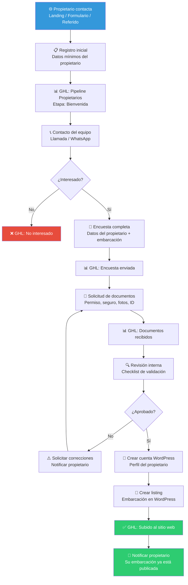
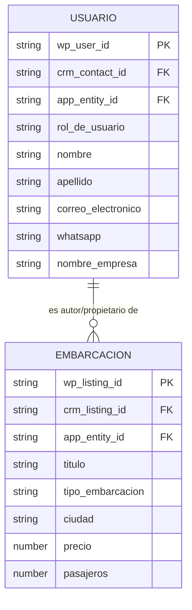

# Flujo de onboarding de propietarios — Yatezzitos Global

> Documento de diseño funcional · Issue [#8](https://github.com/YatezzitosMexico/yatezzitos-platform/issues/8)

---

## Objetivo

Convertir el proceso de alta de nuevas embarcaciones y propietarios en un flujo **estructurado, profesional y replicable**, que funcione tanto para el propietario individual como para agencias, brokers y administradores.

---

## Diagrama del flujo completo

---

## Etapas del flujo en detalle

### Etapa 1 — Captación inicial

**Objetivo:** Capturar el interés del propietario con la menor fricción posible.

**Canales de entrada:**
- Landing page de propietarios en yatezzitos.com
- Formulario de contacto
- WhatsApp directo
- Referido por otro propietario o socio
- Redes sociales

**Datos mínimos en el primer contacto:**

| Campo | Obligatorio | Corresponde a |
|---|---|---|
| Nombre | ✅ | `nombre` + `apellido` |
| Teléfono / WhatsApp | ✅ | `mobile_number` / `whatsapp` |
| Correo electrónico | ✅ | `correo_electronico` |
| Ciudad / puerto de operación | ✅ | (campo libre, se mapea después) |
| Tipo de relación con la embarcación | ✅ | `rol_de_usuario` ⚠️ **Campo nuevo recomendado** |

> **Importante:** En esta etapa NO se piden documentos ni datos extensos. El objetivo es registrar al prospecto en GHL sin espantarlo.

**Acción en GHL:** Se crea contacto → Pipeline de propietarios → Etapa "Bienvenida"

---

### Etapa 2 — Primer contacto del equipo

**Objetivo:** Validar interés real, explicar el proceso y resolver dudas.

**Responsable:** Equipo comercial de Yatezzitos

**Qué se hace:**
- Llamada o WhatsApp dentro de las primeras 24 horas
- Explicar: cómo funciona Yatezzitos, comisiones, proceso de publicación
- Evaluar si la embarcación encaja con el estándar de la plataforma
- Si hay interés, enviar encuesta completa

**Acción en GHL:** Mover a "Contactado" o "No contestó llamada / seguimiento"

---

### Etapa 3 — Datos completos del propietario y embarcación

**Objetivo:** Recopilar toda la información necesaria para crear el perfil y la ficha.

#### A. Datos del propietario / usuario

Estos son los campos que se llenarán en WordPress (Houzez) al crear la cuenta:

**Obligatorios para publicar:**

| Campo | Clave WordPress | Obligatorio |
|---|---|---|
| Foto de perfil | `foto_perfil` | ✅ |
| Nombre de usuario | `nombre_usuario` | ✅ |
| Correo electrónico | `correo_electronico` | ✅ |
| Nombre | `nombre` | ✅ |
| Apellido | `apellido` | ✅ |
| Nombre público | `nombre_publico` | ✅ |
| Número móvil | `mobile_number` | ✅ |
| WhatsApp | `whatsapp` | ✅ |
| Nombre de la empresa | `nombre_empresa` | Recomendado |
| Dirección | `direccion` | Recomendado |
| Sobre mí | `sobre_mi` | Recomendado |

**Opcionales pero valiosos:**

| Campo | Clave WordPress |
|---|---|
| Título / puesto | `titulo_puesto` |
| Licencia | `licencia` |
| Idioma | `idioma` |
| Número de oficina | `office_number` |
| Telegram | `telegram` |
| Número de fax | `numero_fax` |
| Número de impuesto / RFC | `numero_impuesto` |
| Áreas de servicio | `areas_de_servicio` |
| Especialidades | `especialidades` |

**Redes sociales (opcionales):**

| Campo |
|---|
| Facebook, Instagram, X (Twitter), LinkedIn, YouTube, TikTok |
| Pinterest, Google, Vimeo, Skype |
| Sitio web |

> **Campo nuevo recomendado:** `rol_de_usuario` con valores posibles: `propietario`, `administrador`, `vendedor`, `agencia`, `broker`. Actualmente no existe como campo editable en WordPress y es crítico para la lógica futura.

#### B. Datos de la embarcación

Estos son los campos que se llenan al crear un listing en WordPress (Houzez):

**Obligatorios para publicar:**

| Campo | Clave WordPress | Obligatorio |
|---|---|---|
| Autor / usuario asignado | `author_usuario_asignado` | ✅ (vincula embarcación al propietario) |
| Título del anuncio | `titulo_del_anuncio` | ✅ |
| Descripción y contenido | `descripcion_y_contenido` | ✅ |
| Tipo de embarcación | `tipo_de_embarcacion` | ✅ |
| Tipo de anuncio | `tipo_de_anuncio` | ✅ |
| Tipo de experiencia | `tipo_de_experiencia` | ✅ |
| Precio de venta o alquiler | `precio_venta_o_alquiler` | ✅ |
| Tipo de divisa | `tipo_de_divisa` | ✅ |
| Duración del alquiler | `duracion_del_alquiler` | ✅ |
| Galería de imágenes | `galeria_de_imagenes` | ✅ (mínimo 5 fotos) |
| Imagen destacada | `imagen_destacada` | ✅ |
| Número de pasajeros | `numero_de_pasajeros` | ✅ |
| Ciudad | `ciudad` | ✅ |
| Dirección / ubicación | `direccion` | ✅ |

**Recomendados:**

| Campo | Clave WordPress |
|---|---|
| Dormitorios | `dormitorios` |
| Baños | `banos` |
| Año de construcción | `ano_de_construccion` |
| Código postal | `codigo_postal` |
| Latitud / Longitud | `latitud` / `longitud` |
| Pin en el mapa | `pin_mapa` |
| URL del video | `url_del_video` |
| Recorrido virtual 360° | `recorrido_virtual_iframe` |

**Configuración:**

| Campo | Valor recomendado |
|---|---|
| Propiedad destacada | No (requiere aprobación interna) |
| Login requerido para ver | No |
| Renuncia / disclaimer | Texto estándar de Yatezzitos |

**Acción en GHL:** Mover a "Encuesta enviada"

---

### Etapa 4 — Solicitud y recepción de documentos

**Objetivo:** Verificar la confiabilidad del propietario y la legalidad de la embarcación.

**Documentos requeridos:**

| Documento | Obligatorio | Notas |
|---|---|---|
| Identificación oficial (INE/Pasaporte) | ✅ | Del propietario o representante legal |
| Permiso de navegación vigente | ✅ | De la embarcación |
| Seguro de la embarcación | ✅ | Vigente, cobertura mínima para pasajeros |
| Fotos profesionales de la embarcación | ✅ | Mínimo 5 fotos de calidad |
| Acta constitutiva | Solo agencias/empresas | Si es persona moral |
| Contrato de administración | Solo administradores | Si administra embarcación de tercero |

**Cómo se envían:**
- El propietario envía por WhatsApp, email o formulario
- El equipo los almacena en GHL (campos de archivo) y/o carpeta interna

**Acción en GHL:** Mover a "Documentos recibidos"

---

### Etapa 5 — Revisión y aprobación interna

**Objetivo:** Verificar que todo cumple con el estándar de Yatezzitos antes de publicar.

**Checklist de validación:**

| # | Criterio | ¿Aprobado? |
|---|---|---|
| 1 | Identidad del propietario verificada (ID oficial) | ☐ |
| 2 | Permiso de navegación vigente y legible | ☐ |
| 3 | Seguro de embarcación vigente | ☐ |
| 4 | Fotos de calidad profesional (mínimo 5) | ☐ |
| 5 | Datos de la embarcación completos y coherentes | ☐ |
| 6 | Precio alineado con el mercado de la zona | ☐ |
| 7 | Ciudad/destino es uno de los destinos activos de Yatezzitos | ☐ |
| 8 | El propietario aceptó términos y condiciones | ☐ |
| 9 | No hay conflicto con otra embarcación ya publicada | ☐ |
| 10 | La embarcación cumple estándares de seguridad y calidad | ☐ |

**Resultado:**
- ✅ **Aprobado** → Continuar a publicación
- ⚠️ **Correcciones necesarias** → Notificar al propietario qué falta, regresar a Etapa 4
- ❌ **Rechazado** → Informar al propietario con motivo claro

> **Decisión DEC-031:** Toda embarcación nueva DEBE pasar por revisión y aprobación antes de publicarse. No se publican embarcaciones directamente sin validación interna.

---

### Etapa 6 — Creación en WordPress y publicación

**Objetivo:** Crear la cuenta del usuario y la ficha de la embarcación en el sitio.

**Paso 1 — Crear cuenta de usuario WordPress:**
- Llenar campos del perfil (sección A del propietario)
- Asignar `rol_de_usuario` correspondiente (propietario, agencia, broker, etc.)
- Contraseña temporal que el propietario cambiará después

**Paso 2 — Crear listing de embarcación:**
- Llenar todos los campos obligatorios (sección B)
- Asignar `author_usuario_asignado` = el usuario recién creado
- Subir galería de imágenes
- Seleccionar imagen destacada
- NO marcar como destacado aún (requiere revisión de posicionamiento SEO)
- Verificar que la keyword del título no canibalice páginas existentes

**Paso 3 — Publicar:**
- Revisar preview antes de publicar
- Publicar listing
- Verificar que aparece correctamente en la página de la ciudad correspondiente

**Acción en GHL:** Mover a "Subido al sitio web"

---

### Etapa 7 — Notificación y bienvenida

**Objetivo:** Informar al propietario que su embarcación ya está en línea.

**Comunicación al propietario:**
- Link directo a su embarcación publicada
- Datos de acceso a su cuenta WordPress (si aplica)
- Explicación de cómo se manejan las reservas
- Contacto directo del equipo asignado
- Invitación a compartir la ficha en sus redes

---

## Tabla de responsabilidades

| Acción | Propietario | Equipo Yatezzitos |
|---|---|---|
| Llenar formulario inicial | ✅ | |
| Primer contacto (llamada/WhatsApp) | | ✅ |
| Proporcionar datos completos | ✅ | |
| Enviar documentos y fotos | ✅ | |
| Verificar documentos | | ✅ |
| Aprobar publicación | | ✅ |
| Crear cuenta WordPress | | ✅ |
| Crear listing de embarcación | | ✅ |
| Subir fotos al listing | | ✅ (con fotos del propietario) |
| Notificar publicación | | ✅ |
| Compartir ficha en redes | ✅ (opcional) | |
| Actualizar disponibilidad | ✅ (futuro) | ✅ (hoy, manual) |

---

## Conexión con el pipeline de propietarios en GHL

El pipeline de propietarios ya existente en GoHighLevel se alinea así:

| Etapa GHL actual | Etapa del onboarding | Notas |
|---|---|---|
| Bienvenida por canal de entrada | Etapa 1 — Captación | Lead nuevo registrado |
| Contactado | Etapa 2 — Primer contacto | Equipo habló con propietario |
| No contestó llamada / seguimiento | Etapa 2 | Requiere re-contacto |
| Encuesta enviada | Etapa 3 — Datos completos | Propietario llenó info |
| **Documentos recibidos** ⚠️ | Etapa 4 | **Etapa nueva recomendada** |
| **En revisión** ⚠️ | Etapa 5 | **Etapa nueva recomendada** |
| En espera | Cualquiera | Propietario no avanza temporalmente |
| No interesado | Descarte | No quiere continuar |
| Subido al sitio web | Etapa 6 — Publicado | ✅ Embarcación activa |

> **Recomendación:** Agregar las etapas **"Documentos recibidos"** y **"En revisión"** al pipeline de propietarios en GHL para tener mejor visibilidad del proceso.

---

## Arquitectura de sincronización WordPress ↔ CRM ↔ App futura

Para que la misma información esté disponible en WordPress, GoHighLevel y la futura app:

### Entidades y relaciones

### IDs de sincronización recomendados

| Campo | Descripción | Dónde vive |
|---|---|---|
| `wp_user_id` | ID del usuario en WordPress | WordPress |
| `wp_listing_id` | ID del listing en WordPress | WordPress |
| `crm_contact_id` | ID del contacto en GoHighLevel | GHL |
| `app_entity_id` | ID futuro para la app | App (futuro) |
| `rol_de_usuario` | Tipo: propietario / agencia / broker / vendedor | Ambos (WP + GHL) |
| `propietario_principal_id` | En caso de admin/broker, quién es el dueño real | GHL + App |

> **Recomendación:** Estos campos de sincronización deben crearse **ahora** aunque la app no exista todavía. Así se evita un caos de migración después.

---

## Métricas del proceso de onboarding

| Métrica | Objetivo |
|---|---|
| Tiempo de primer contacto después del registro | < 24 horas |
| Tiempo total de onboarding (registro → publicación) | < 7 días |
| Tasa de conversión (registro → publicación) | > 50% |
| Tasa de documentos completos al primer envío | > 70% |
| Embarcaciones rechazadas por calidad | < 15% |

---

## Issues relacionados

| Issue | Relación |
|---|---|
| [#7 — Captación de propietarios](https://github.com/YatezzitosMexico/yatezzitos-platform/issues/7) | Landing + formulario de captación |
| [#9 — Calendario de disponibilidad](https://github.com/YatezzitosMexico/yatezzitos-platform/issues/9) | Futuro: propietarios actualizan su disponibilidad |
| [#13 — Panel de propietarios](https://github.com/YatezzitosMexico/yatezzitos-platform/issues/13) | Futuro: propietarios gestionan sus embarcaciones |
| [#17 — Asistente IA propietarios](https://github.com/YatezzitosMexico/yatezzitos-platform/issues/17) | Futuro: IA guía el onboarding |

---

*Última actualización: 13 de marzo 2026*
