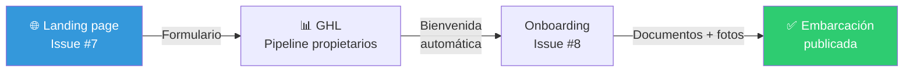

# Plan de implementación — Captación de propietarios (Issue #7)

> Plan de acción · Issue [#7](https://github.com/YatezzitosMexico/yatezzitos-platform/issues/7)

---

## Objetivo

Crear una landing page y formulario efectivos para captar nuevos propietarios de embarcaciones que quieran publicar en Yatezzitos.

---

## Tareas paso a paso

### Bloque 1 — Landing page en WordPress (2-3 hrs)

- [ ] Crear página en WordPress con Elementor: `/socios` o `/publica-tu-embarcacion`

**Secciones de la landing:**

| Sección | Contenido |
|---|---|
| Hero | Título: "Publica tu embarcación en Yatezzitos" + CTA |
| Beneficios | Más reservas, exposición digital, soporte, sin costo de publicación |
| Cómo funciona | 3 pasos: "Regístrate → Subimos tu yate → Empiezas a recibir reservas" |
| Testimonios | De propietarios actuales (si hay) |
| FAQ | Preguntas frecuentes sobre comisiones, proceso, tiempos |
| Formulario | Datos mínimos de captación |
| Footer CTA | Botón de WhatsApp directo |

### Bloque 2 — Formulario de captación (30 min)

**Campos del formulario:**

| Campo | Tipo | Obligatorio |
|---|---|---|
| Nombre completo | Texto | ✅ |
| Teléfono / WhatsApp | Teléfono | ✅ |
| Email | Email | ✅ |
| Ciudad / puerto de operación | Dropdown | ✅ |
| Tipo de embarcación | Dropdown (yate, catamarán, velero, lancha, otro) | ✅ |
| ¿Es propietario o administrador? | Radio | ✅ |
| Mensaje / comentarios | Textarea | Opcional |

- [ ] Crear formulario en GHL o Elementor
- [ ] Conectar vía webhook a GHL
- [ ] Al enviar: crear contacto en GHL → pipeline de propietarios → etapa "Bienvenida"
- [ ] Asignar tag `fuente:landing-propietarios`
- [ ] Asignar `rol_de_usuario: propietario` (o el valor que seleccione)

### Bloque 3 — Automatización de bienvenida (30 min)

- [ ] Crear workflow en GHL:
  - **Trigger:** Contacto nuevo con tag `fuente:landing-propietarios`
  - **Acción 1:** WhatsApp de bienvenida:
    > ¡Hola [nombre]! Gracias por tu interés en publicar tu embarcación en Yatezzitos. 🚢 Un asesor te contactará pronto para explicarte el proceso.
  - **Acción 2:** Email de bienvenida con más detalle
  - **Acción 3:** Notificar al equipo interno
  - **Acción 4:** Si no hay contacto en 24h → recordatorio al equipo

### Bloque 4 — SEO de la landing (30 min)

- [ ] Keyword principal: "publicar embarcación" o "publicar yate"
- [ ] Title SEO optimizado
- [ ] Meta description
- [ ] H1 con keyword
- [ ] Texto de 300+ palabras orientado a propietarios

### Bloque 5 — Promoción (continuo)

- [ ] Agregar link en el menú de navegación: "Socios" o "Publica tu yate"
- [ ] Agregar link en el footer
- [ ] Compartir en redes sociales
- [ ] Preparar campaña de Google Ads (futuro)
- [ ] Pedir a propietarios actuales que refieran

---

## Tiempo estimado total: **4-5 horas**

---

## Resultado esperado

Después de ejecutar este plan:
- ✅ Landing profesional en yatezzitos.com para captar propietarios
- ✅ Formulario conectado a GHL con asignación automática
- ✅ Bienvenida automática por WhatsApp y email
- ✅ Flujo de onboarding activado (se conecta con Issue #8)
- ✅ Link visible en navegación y footer

---

## Relación con el flujo de onboarding

---

*Última actualización: 13 de marzo 2026*
